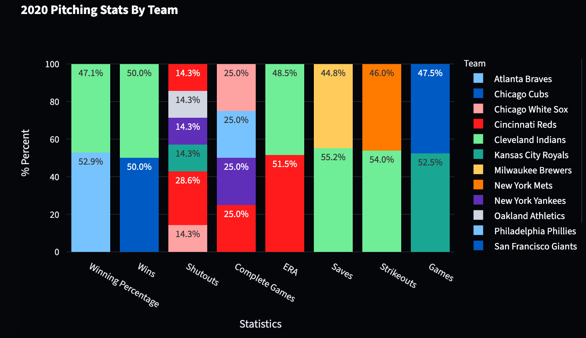
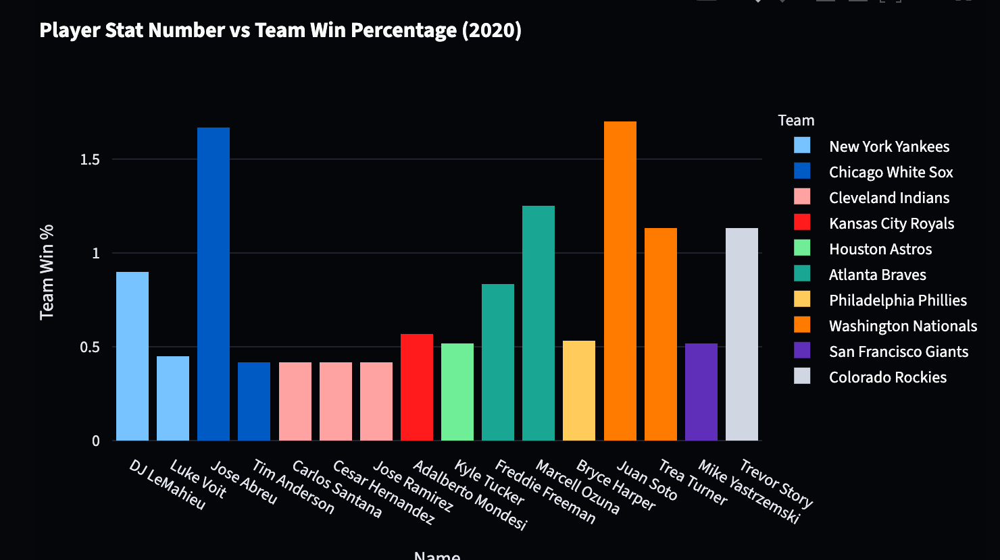
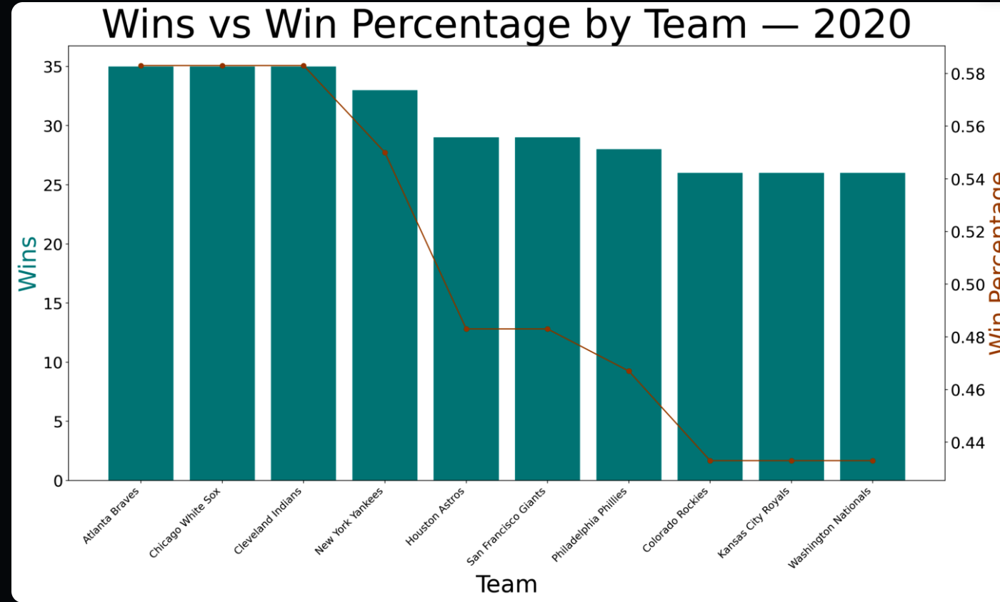

# MLB Historical Data Dashboard

   


## Description

This project uses Selenium to collect data points on historical stats from the [Major League Baseball (MLB) History](https://www.baseball-almanac.com/yearmenu.shtml) website and displays the results in an interactive dashboard. The pipeline covers the full data lifecycle: web scraping with Selenium, data cleaning, transforming raw data into a structured format, storing it in a SQLite database, querying via the command line, and presenting the results using Streamlit with interactive visualizations.

---
- [Tech Stack](#tech-stack)
- [Project Structure](#project-structure)
- [Getting Started](#getting-started)
  - [Clone the Repository](#clone-the-repository)
  - [Set Up Virtual Environment](#set-up-virtual-environment)
  - [Install Requirements](#install-requirements)
- [Running the Project](#running-the-project)
  - [Web Scraping & CSV Export](#web-scraping--csv-export)
  - [Database Setup](#database-setup)
  - [Querying the Database](#querying-the-database)
  - [Launching the Dashboard](#launching-the-dashboard)
- [Dashboard Visualizations](#dashboard-visualizations)
- [Optimizations](#optimizations)
- [Limitations](#limitations)

---

## Tech Stack

| Tool | Purpose |
|---|---|
| **Python** | Core programming language |
| **Selenium** | Web scraping MLB historical data |
| **Pandas** | Data cleaning and transformation |
| **SQLite** | Local relational database storage |
| **Streamlit** | Interactive web dashboard |
| **Plotly Express** | Interactive charts and graphs |
| **Matplotlib** | Static data visualizations |

---

## Project Structure

```
mlb-stats-webscrapping-project/
│
├── webscrapping.py         # Selenium scraper — collects data and exports to CSV
├── csv         # Raw/cleaned data stored 
  ├──hitting_leaders.csv 
  ├──pitching_leader.csv
  ├──team_standing.csv
├── baseball_to_sql.py         #Script to create SQLite database and populate (hitting, pitching, standings)        
├── db 
  ├── baseball-stats_20_23.db         # Holds scraped data in 3 tables
├──sql_join_baseball_stats.py         #Joins Standing<>Hitting table Standing<>Pitching and returned Dataframe 
├── visualization.py         #Streamlit dashboard application
├── requirements.txt         #Project dependencies
└── README.md
```

---

## Getting Started

### Clone the Repository

```bash
git clone https://github.com/Yassahr/mlb-stats-webscrapping-project.git
cd baseball-web-scraping
```

### Set Up Virtual Environment

**macOS / Linux:**
```bash
python3 -m venv venv
source venv/bin/activate
```

**Windows:**
```bash
python -m venv venv
venv\Scripts\activate
```

> You should see `(venv)` appear in your terminal prompt once the environment is active.

### Install Requirements

With the virtual environment active, install all project dependencies:

```bash
pip install -r requirements.txt
```

---

## Running the Project
To run the project from scratch(with no DB)
webscrapping.py -> baseball_to_sql.py -> sql_join_baseball_stats.py -> visualizations 

To only see Streamlit Dashboard run: 

```bash
streamlit run visualization.py
```


### Web Scraping & CSV Export

Run the scraper to collect historical MLB data from the website and export it to a CSV file:

```bash
python webscrapping.py
```

This will generate hitting_leaders.csv, pitching_leader.csv, and team_standing.csv in the project csv/ folder containing the raw stats data.

### Database Setup

Run the database setup script to create the SQLite database and load the CSV data into structured tables:

```bash
python baseball_to_sql.py 
```

This creates `baseball-stats_20_23.db` with **3 tables**:
View using SQLite Viewer Extension
| Table | Description |
|---|---|
| `hitting` | Top hitting stats per season (2020–2023) |
| `pitching` | Top pitching stats per season (2020–2023) |
| `standings` | Team standings per season (2020–2023) |

### Querying the Database

You can query the database. This is a script to JOIN the SQL tables and create Datafranes:

```bash
python sql_join_baseball_stats.py
```

### Launching the Dashboard

Start the Streamlit dashboard with:

```bash
streamlit run visualization.py
```

The app will open in your browser at `http://localhost:8501`.

---

## Dashboard Visualizations

The dashboard features a **year dropdown** allowing you to filter all graphs by season (2020–2023). The three visualizations include:

1. **[Pitching Stats By Team]** — [ Shows each Pitching statistic and which teams dominate the stats in each catergory]

2. **[Player Stat Number vs Team Win Percentage]** — [Shows insights for the relationship between the stats and the team winning percentage]

3. **[Wins vs Win Percentage by Team]** — [Shows winning percentage vs the amount of wins each team has]


---

## Optimizations

Future improvements to expand the scope and depth of this project:

- **Expand year range** — Include additional seasons beyond 2020–2023 for broader historical analysis
- **Player career analysis** — Add analysis on individual player stats relative to their years in the league
- **Team performance correlation** — Examine the relationship between individual player performance and overall team outcomes

---

## Limitations

- Data is broken down by individual year; **cross-year team analysis** is not currently supported but would add significant analytical value
- The dataset only covers **3 seasons (2020–2023)**; a larger year range would improve the reliability of trend analysis
- [Any additional limitations specific to the MLB website or scraper]

---


---

## Author

(Yassah Reed)[https://github.com/Yassahr]
